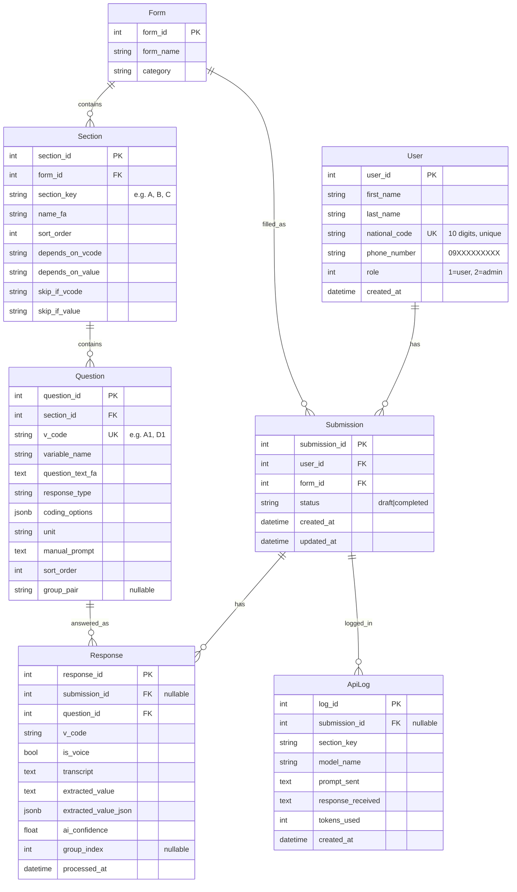

# Data Model

All models live in `app/models.py:1` and share `Base` from `app/db/base.py:4`. Primary keys are auto-increment integers. No explicit relationships / backrefs — queries join manually.

## ER diagram



---

## Tables in detail

### `users` — `User` (`app/models.py:8`)

| Column | Type | Constraints | Notes |
|---|---|---|---|
| `user_id` | Integer | PK, autoincrement | |
| `first_name` | String(100) | nullable | |
| `last_name` | String(100) | nullable | |
| `national_code` | String(20) | **NOT NULL, UNIQUE** | 10 digits validated in `auth.py:29` (`^\d{10}$`) |
| `phone_number` | String(20) | nullable | 11 digits `^09\d{9}$` if provided |
| `role` | Integer | default `1` | `1` = regular, `2` = admin |
| `created_at` | DateTime | `server_default=now()` | |

No password column — login is national-code-only.

### `forms` — `Form` (`app/models.py:19`)

| Column | Type | Notes |
|---|---|---|
| `form_id` | Integer PK | |
| `form_name` | String(255) NOT NULL | Displayed in dashboard |
| `category` | String(100) nullable | E.g. `baseline`, `followup` |

A questionnaire definition. All sections belong to one form; submissions point to a form.

### `sections` — `Section` (`app/models.py:26`)

| Column | Type | Notes |
|---|---|---|
| `section_id` | Integer PK | |
| `form_id` | Integer FK → `forms.form_id` | No DB cascade — handled in `admin.py:298` |
| `section_key` | String(50) | Short key like `A`, `B`, `MEDS`; used in routes + transcripts grouping |
| `name_fa` | String(255) | Persian section title |
| `sort_order` | Integer default `0` | Ordering in `GET /get-form-structure` (`questionnaire.py:32`) |
| `depends_on_vcode` | String(20) nullable | Show only if this `v_code` equals `depends_on_value` |
| `depends_on_value` | String nullable | Value to match for visibility |
| `skip_if_vcode` | String(20) nullable | Hide if this `v_code` equals `skip_if_value` |
| `skip_if_value` | String nullable | Value that triggers skip |

Both pairs evaluated live in `static/app.js:226` (`updateQuestionVisibility`). Mutually composable — a section can have both.

### `questions` — `Question` (`app/models.py:39`)

| Column | Type | Notes |
|---|---|---|
| `question_id` | Integer PK | |
| `section_id` | Integer FK → `sections.section_id` | |
| `v_code` | String(20) **UNIQUE** | Canonical variable code (`A1`, `D1`) — the join key everywhere |
| `variable_name` | String(100) | Human variable name |
| `question_text_fa` | Text | Persian prompt shown to user + sent to Gemini |
| `response_type` | String(50) | `Categorical`, `Dichotomous`, `Numeric`, `Continuous`, `Date`, `Text`, `MultiSelect` |
| `coding_options` | JSONB | `{ "1": "زن", "2": "مرد" }` — option code → label |
| `unit` | String(50) | Expected unit for numeric (`سال`, `kg`, …) — drives unit conversion |
| `manual_prompt` | Text nullable | If set, overrides type-aware rule generation (`ai_engine.py:487`) |
| `sort_order` | Integer default `0` | Ordering within section |
| `group_pair` | String(100) nullable | Groups repeated items (e.g. `meds`); questions sharing a `group_pair` are rendered as a multi-row container |

`response_type` drives the extraction rule in `PromptGenerator.generate_section_prompt()` (`app/services/ai_engine.py:478`).

!!! note "v_code uniqueness"
    `v_code` is globally unique (DB `unique=True`). Grouped answers use indexed keys `V_1`, `V_2`… (`MAX_GROUP_ENTRIES=6` in `ai_engine.py:408`) — these are **not** separate `Question` rows, they're indexed variants of the base `v_code`.

### `submissions` — `Submission` (`app/models.py:54`)

| Column | Type | Notes |
|---|---|---|
| `submission_id` | Integer PK | |
| `user_id` | Integer FK → `users.user_id` | |
| `form_id` | Integer FK → `forms.form_id` | NOT NULL in practice; fallback to first form in `questionnaire.py:254` |
| `status` | String(20) default `draft` | `draft` or `completed` |
| `created_at` | DateTime `server_default=now()` | |
| `updated_at` | DateTime `server_default=now()` | Updated to `now()` on `complete-submission` (`questionnaire.py:390`) |

Progressive resume: `POST /start-submission` reuses the most recent submission per `(user_id, form_id)` regardless of status (`questionnaire.py:262`), reopening `completed` → `draft`.

### `responses` — `Response` (`app/models.py:64`)

| Column | Type | Notes |
|---|---|---|
| `response_id` | Integer PK | |
| `submission_id` | Integer FK nullable | `nullable` so responses can exist before submission is finalized |
| `question_id` | Integer FK | |
| `v_code` | String(20) | Denormalized from `Question.v_code` for easier querying |
| `is_voice` | Boolean default `True` | `False` if value was manually edited (preserved unless value changes; `questionnaire.py:365`) |
| `transcript` | Text | Verbatim transcript — stored per response row (duplicated per v_code in section) |
| `extracted_value` | Text | Stringified extracted value; `N/A` for inapplicable |
| `extracted_value_json` | JSONB | Structured variant (currently unused beyond storage) |
| `ai_confidence` | Float | `0..1` from Gemini |
| `group_index` | Integer nullable | `0`, `1`… for grouped items; `NULL` for non-grouped. Uniqueness is `(submission_id, v_code, group_index)` in `upsert_response()` |
| `processed_at` | DateTime `server_default=now()` | |

Upsert logic in `app/services/responses.py:8` — `(submission_id, v_code, group_index)` is the logical key. Re-recording overwrites instead of duplicating.

### `api_logs` — `ApiLog` (`app/models.py:80`)

| Column | Type | Notes |
|---|---|---|
| `log_id` | Integer PK | |
| `submission_id` | Integer FK nullable | |
| `section_key` | String(50) | Which section triggered the call |
| `model_name` | String(100) | Model that actually responded (after failover) |
| `prompt_sent` | Text | Full prompt |
| `response_received` | Text | Raw JSON response |
| `tokens_used` | Integer | If reported |
| `created_at` | DateTime `server_default=now()` | |

Surfaced via `GET /api/admin/api-logs` (`admin.py:535`) with truncated previews. Also used for `avg_confidence` stats.

---

## Seeding example

```sql
INSERT INTO forms (form_name, category) VALUES ('Cohort Baseline', 'baseline'); -- id 1
INSERT INTO sections (form_id, section_key, name_fa, sort_order) VALUES (1, 'A', 'اطلاعات دموگرافیک', 0);
INSERT INTO questions (section_id, v_code, variable_name, question_text_fa, response_type, coding_options, sort_order)
VALUES (1, 'A1', 'age', 'سن شما چند سال است؟', 'Numeric', NULL, 0),
       (1, 'A4', 'gender', 'جنسیت', 'Categorical', '{"1":"زن","2":"مرد"}', 1);
```

Or via Admin API — see [Quick Start](../getting-started/quickstart.md) and [Admin API](../api/admin.md).

---

## Constraints & gaps (be aware)

- **No FK cascades in DB** — `admin.py` manually deletes children (`forms → sections → questions`, `submissions → responses + api_logs`). Direct SQL deletes need manual cleanup.
- **No unique constraint on `(submission_id, v_code, group_index)`** in DB — deduplication is application-level in `upsert_response()`. Concurrent writes could race.
- **`Submission.updated_at`** has `server_default=now()` but no `onupdate` — only `complete-submission` sets it explicitly.
- **`Response.transcript`** is duplicated per v_code in the same section recording — storage-inefficient but simple to query.
