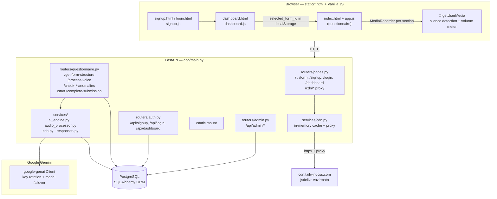
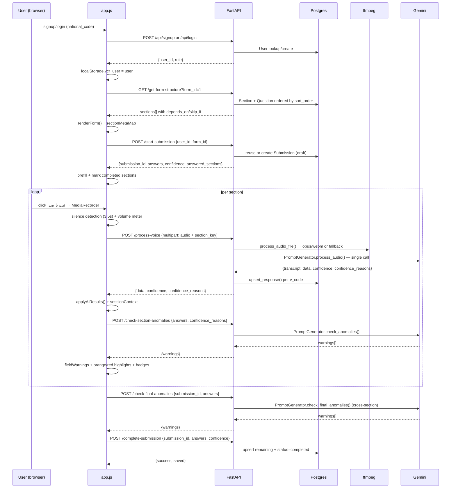

# Architecture Overview

## High-level diagram



---

## Process wiring

`main.py:1` is a thin shim that re-exports `app.main:app` and honors `$PORT`:

```python
# main.py:11
from app.main import app
uvicorn.run(app, host="0.0.0.0", port=int(os.getenv("PORT", "8000")))
```

`app/main.py:17` builds the app:

```python
def create_app() -> FastAPI:
    Base.metadata.create_all(bind=engine)   # no migrations
    os.makedirs(UPLOAD_DIR, exist_ok=True)
    app.mount("/static", StaticFiles(directory=str(STATIC_DIR)))
    app.include_router(pages.router)
    app.include_router(questionnaire.router)
    app.include_router(admin.router)
    app.include_router(auth.router)
```

No middleware, no CORS, no background tasks — single process serves API + static frontend.

---

## Request lifecycle (form fill)



---

## Module map

| Path | Role | Key exports |
|---|---|---|
| `main.py` | Entrypoint shim | `app` re-export, `$PORT` binding |
| `app/main.py` | App factory | `create_app()`, router wiring, `create_all`, `/static` mount |
| `app/core/config.py` | Central config | `DATABASE_URL`, `AUDIO_MODEL`, `ANOMALY_MODEL`, `FALLBACK_MODELS`, `get_api_keys()`, `get_proxy_url()` |
| `app/db/base.py` | ORM base | `Base = declarative_base()` |
| `app/db/session.py` | Engine + session | `engine`, `SessionLocal`, `get_db()` dependency |
| `app/models.py` | ORM models | `User`, `Form`, `Section`, `Question`, `Submission`, `Response`, `ApiLog` |
| `app/routers/pages.py` | Page + CDN routes | `GET /`, `/form`, `/signup`, `/login`, `/dashboard`, `/cdn/*` |
| `app/routers/auth.py` | Auth + dashboard | `POST /api/signup`, `/api/login`, `GET /api/dashboard` |
| `app/routers/questionnaire.py` | Form flow | `GET /get-form-structure`, `POST /process-voice`, `/check-*-anomalies`, `/start+complete-submission` |
| `app/routers/admin.py` | Admin CRUD | `GET/POST/PUT/DELETE /api/admin/{forms,sections,questions,users,submissions,api-logs,export}` |
| `app/services/ai_engine.py` | Gemini engine | `PromptGenerator`, `_run_with_failover`, `_try_keys`, `_KeyRotator` |
| `app/services/audio_processor.py` | ffmpeg pipeline | `process_audio_file()`, `get_ffmpeg()` |
| `app/services/cdn.py` | CDN proxy | `fetch_cdn_resource()` with in-memory cache |
| `app/services/responses.py` | Persistence helper | `upsert_response()` |
| `static/*.html` | Frontend pages | `signup.html`, `login.html`, `dashboard.html`, `index.html` (form) |
| `static/*.js` | Frontend logic | `app.js` (form), `dashboard.js`, `signup.js` |
| `uploads/` | Temp audio | Auto-created, files removed on success |

---

## Design choices & trade-offs

| Choice | Why | Trade-off |
|---|---|---|
| **No migrations** (`create_all`) | Zero setup for demos / HF Spaces | Schema changes need manual `DROP`/`ALTER` or a migration tool added later |
| **Single Gemini call per section** | Lower latency & cost than multi-call | Prompt is large; one failure loses the whole section (mitigated by retry) |
| **Vanilla JS + Tailwind CDN** | No build step, fast iteration, small repo | No bundling/tree-shaking; CDN dependency (mitigated by `/cdn/*` proxy) |
| **Server ffmpeg, not client** | Consistent output, no browser quirks | Needs ffmpeg on server; fallback exists |
| **National-code-only login** | Matches field-worker reality (no passwords) | Not authentication — must add password/session before public exposure |
| **Admin routes without auth** | Fast internal tooling | Must gate before any public deploy (see [Security](../operations/security.md)) |
| **In-memory CDN cache** | Simple, no extra infra | Cache lost on restart; no TTL — fine for static assets |

---

## Data flow invariants

- **One answer per `(submission_id, v_code, group_index)`** — enforced by `upsert_response()` (`app/services/responses.py:14`), not by DB constraint. Re-recording overwrites.
- **`N/A` vs `null`**: `N/A` = logically inapplicable (gateway says "no"); `null` = not mentioned / unextracted. Anomaly checker never flags `N/A`.
- **Confidence `1` with `null`** is valid (confidently not mentioned). Confidence `<1` must have a non-empty `confidence_reasons` entry; `N/A` must be confidence `1` with reason `غیرمرتبط` (`app/services/ai_engine.py:616`).
- **Sections are ordered** by `sort_order`; questions within each section also by `sort_order` (`app/routers/questionnaire.py:32`).
