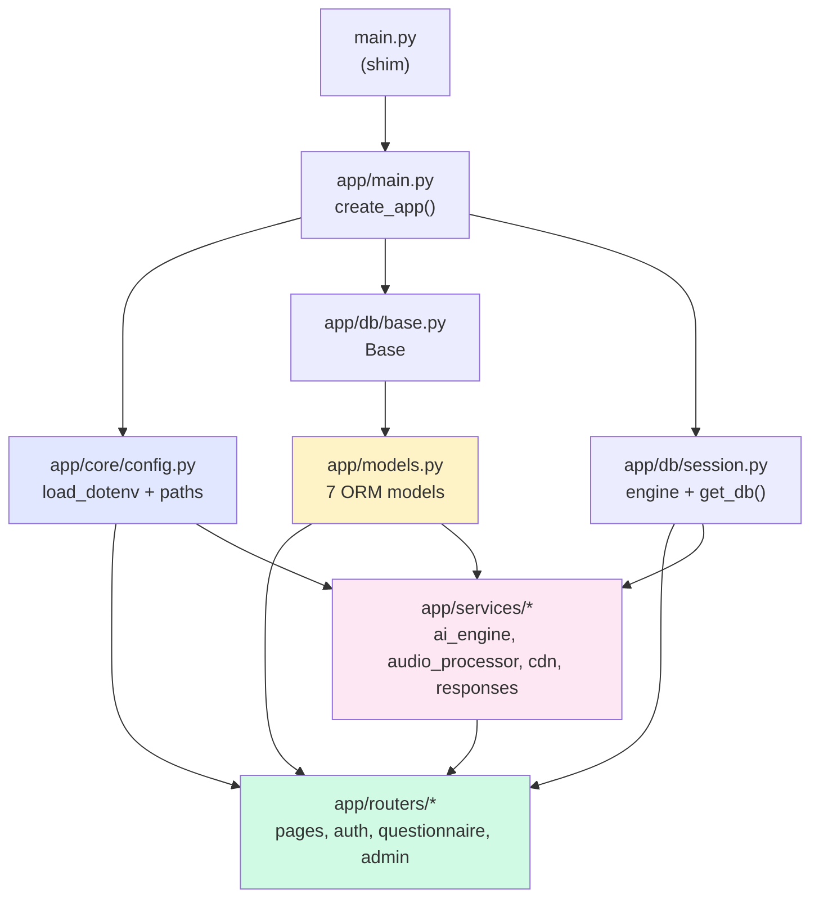

# Project Structure

```
VoiceCohortRecord/
├── main.py                   # Entrypoint shim — re-exports app.main:app, honors $PORT
├── app/
│   ├── main.py               # FastAPI factory — create_app(), create_all, mount /static, include routers
│   ├── models.py             # SQLAlchemy ORM — User, Form, Section, Question, Submission, Response, ApiLog
│   ├── core/
│   │   └── config.py         # Env loading, paths (BASE_DIR/STATIC_DIR/UPLOAD_DIR), model/key/proxy/timeout config
│   ├── db/
│   │   ├── base.py           # Base = declarative_base()
│   │   └── session.py        # engine, SessionLocal, get_db() dependency
│   ├── routers/
│   │   ├── pages.py          # Page routes (/, /form, /signup, /login, /dashboard) + CDN proxy (/cdn/*)
│   │   ├── auth.py           # /api/signup, /api/login, /api/dashboard
│   │   ├── questionnaire.py  # /get-form-structure, /process-voice, /check-*-anomalies, /start+complete-submission
│   │   └── admin.py          # /api/admin/* — stats, CRUD for forms/sections/questions, users, submissions, logs, export
│   └── services/
│       ├── ai_engine.py      # PromptGenerator, _run_with_failover, _try_keys, _KeyRotator, failover + schema + anomalies
│       ├── audio_processor.py# process_audio_file() — ffmpeg silence trim + EBU R128 + opus/webm re-encode
│       ├── cdn.py            # fetch_cdn_resource() — in-memory cache + proxy-aware httpx
│       └── responses.py      # upsert_response() — (submission, v_code, group_index) dedup
├── static/
│   ├── index.html            # Questionnaire shell + custom CSS (progress/warning/toast/modal)
│   ├── app.js                # Questionnaire logic — render, group, record, volume, progress, warnings, retry, submit
│   ├── dashboard.html        # Dashboard shell
│   ├── dashboard.js          # Dashboard logic — user vs admin, stats, submissions, users, CRUD
│   ├── signup.html           # Signup shell
│   ├── signup.js             # Signup validation + POST /api/signup
│   └── login.html            # Login shell (inline JS → POST /api/login)
├── tests/
│   ├── test_ai_engine_failover.py  # Key rotation + model failover unit tests (mocked)
│   └── test_audio_processor.py     # process_audio_file() tests (ffmpeg mocked)
├── docs/                     # MkDocs Material site (this site)
│   ├── index.md
│   ├── getting-started/
│   ├── architecture/
│   ├── guides/
│   ├── api/
│   ├── operations/
│   ├── development/
│   ├── stylesheets/extra.css
│   └── overrides/            # optional theme overrides
├── requirements.txt          # fastapi, uvicorn, sqlalchemy, psycopg2-binary, google-genai, python-dotenv, python-multipart
├── Dockerfile                # python:3.10-slim + ffmpeg, uvicorn on $PORT (7860 for HF Spaces)
├── .env                      # gitignored — DATABASE_URL, GEMINI_API_KEYS, proxy, tuning knobs
├── .gitignore
├── mkdocs.yml                # MkDocs Material config — nav, theme, plugins, extensions
├── backup-22-08-2026.sql     # Optional DB dump for seeding (if present)
├── FIXES.md                  # Task tracker (question texts, proxy, pill names, audio tuning)
└── uploads/                  # Temp audio — gitignored, auto-created, cleaned on success
```

---

## Key entry points

| Path | How to invoke | What it does |
|---|---|---|
| `main.py` | `python main.py` | Re-exports `app.main:app`, runs `uvicorn` on `0.0.0.0:$PORT` |
| `app/main.py:17` | `uvicorn main:app --reload` or `uvicorn app.main:app --reload` | Builds `FastAPI`, `create_all`, mounts `/static`, includes all routers |
| `mkdocs.yml` | `mkdocs serve` / `mkdocs build` | Builds this docs site |

The app has **no CLI** beyond the HTTP API + dashboard. All mutations go through endpoints or direct SQL.

---

## Dependency graph



- `config.py` is the **single** `load_dotenv()` site — importing it loads `.env` for the whole process.
- `models.py` has **no** relationships/backrefs — joins are manual in routers.
- `services/` is pure logic — no router imports, only `config`, `models`, `httpx`, `google.genai`.

---

## Conventions

| Convention | Detail |
|---|---|
| IDs as strings in HTTP | `user_id`, `submission_id` serialized as `str()` despite `Integer` PKs |
| No migrations | `Base.metadata.create_all(bind=engine)` on startup; manual `ALTER` for schema changes |
| No auth middleware | Identity via `user_id`/`national_code` in payloads; admin unchecked |
| Error envelope | `{error: "…Persian…"}` with `200`, not `4xx` — not REST-idiomatic |
| `int()` with try/except | All ID params parsed as `str` → `int()` with fallback to `{error}` |
| `print()` logging | No structured logger — prints to stdout, visible in `uvicorn` / `docker logs` |

---

## Adding a new feature — where to touch

| Feature | Files |
|---|---|
| New page / route | `app/routers/pages.py` + `static/*.html` |
| New API endpoint | `app/routers/*.py` + `app/models.py` if new table |
| New question type | `app/services/ai_engine.py:528` (prompt rule) + `static/app.js:706` (render) + `app/models.py` if new column |
| New anomaly rule | `ai_engine.py:226` (prompt text) — no code logic, just prompt |
| New config knob | `app/core/config.py` (constant + `os.getenv`) + `.env` + docs |
| Audio tuning | `app/services/audio_processor.py:20` constants + `static/app.js:11` thresholds |

Keep changes **database-driven** where possible — prefer new `Question` rows over new code.
