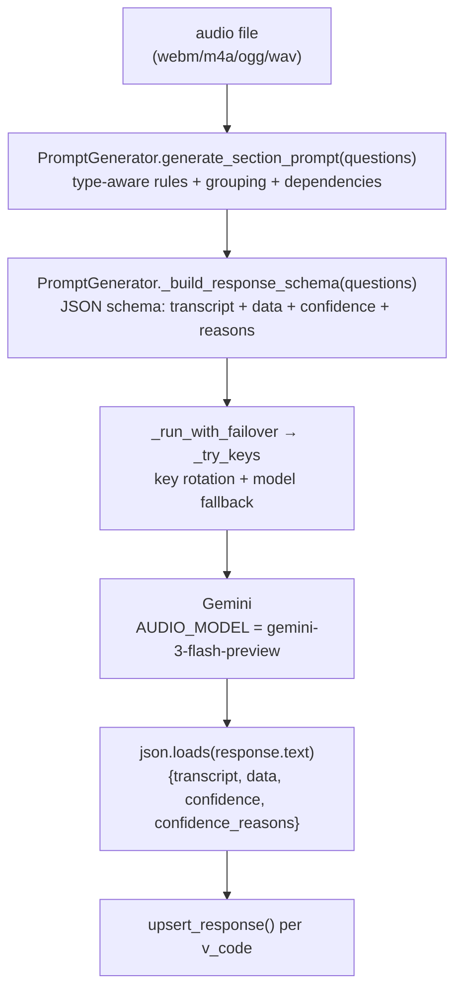

# AI Extraction Engine

One Gemini call per section returns transcript, structured answers, confidence, and reasons — with key rotation and model failover underneath.

Source: `app/services/ai_engine.py:1` (673 lines).

---

## Overview



---

## Prompt generation — `generate_section_prompt()` (`ai_engine.py:478`)

Builds a spec line per question, then wraps with global instructions.

### Per-question rules

| `response_type` | Rule (Persian-aware) | Example |
|---|---|---|
| `Categorical` / `Dichotomous` | `Return ONLY the integer code. Options: … If not mentioned, null.` | `CODE A4: Return ONLY the integer code. Options: 1=زن, 2=مرد.` |
| `Numeric` / `Continuous` (with `unit`) | Extract numeric, convert unit if speaker says متر/میلی‌متر → expected unit, return value only | `Expected unit is 'سال'. If speaker says متر, convert to سال accurately.` |
| `Numeric` (no unit) | Remove spoken unit | |
| `Date` | `Format as YYYY-MM-DD. If only year, YYYY-01-01.` | |
| `Text` | Exact phrase | |
| `MultiSelect` | `Return ONLY comma-separated integer codes. Options: …` | `1,3,5` |
| Any with `manual_prompt` | `CODE V: <manual_prompt>` verbatim — skips type logic | |
| Any with `group_pair` | Appended: *this question can have multiple answers; extract each as `V_0`, `V_1`…; same index for partners; only mentioned indices* | |

For grouped items, `grouped` dict is built first (`ai_engine.py:483`) and partner codes are listed.

### Global instructions appended

```
You are a medical data entry assistant. Transcribe audio in Farsi and extract...
- IMPORTANT: Never guess/infer; null if not mentioned.
- TRANSCRIPT: FULL, VERBATIM in Farsi — every word, no summarizing.
- CONDITIONAL QUESTIONS: gateway logic (diabetes, smoking, dentures, napping, surgery…)
  STRICT RULES:
    1. Logically inapplicable → "N/A"
    2. Gateway not mentioned → dependent = null (not N/A)
    3. Applicable but not mentioned → null (not N/A)
    4. Never N/A merely because not mentioned
- CONFIDENCE 0..1 + reason; null/N/A rules; N/A must be 1 with reason "غیرمرتبط"
```

The dependency chain examples (diabetes, smoking, etc.) are **hardcoded examples** (`ai_engine.py:594`) — not DB-driven. They guide the model but the authoritative logic is `N/A` vs `null` semantics.

---

## Response schema — `_build_response_schema()` (`ai_engine.py:396`)

```json
{
  "type":"object",
  "properties":{
    "transcript":{"type":"string"},
    "data":{"type":"object","properties":{"A1":{"type":"string",...},"A4":{...}},"required":["A1","A4"]},
    "confidence":{"type":"object","properties":{"A1":{"type":"number","minimum":0,"maximum":1}},"required":["A1","A4"]},
    "confidence_reasons":{"type":"object","properties":{"A1":{"type":"string"}},"required":["A1","A4"]}
  },
  "required":["transcript","data","confidence","confidence_reasons"]
}
```

- Base `v_code`s are **required** in `data`/`confidence`/`confidence_reasons`.
- For each `group_pair`, indexed keys `V_1`…`V_5` (`MAX_GROUP_ENTRIES=6`) are added as **optional** (`ai_engine.py:432`).

Used with `response_mime_type="application/json"` and `response_schema=schema` in `GenerateContentConfig` (`ai_engine.py:651`).

---

## Audio ingestion — `process_audio()` (`ai_engine.py:621`)

```python
mime_type_map = {'.webm':'audio/webm','.m4a':'audio/mp4','.ogg':'audio/ogg','.wav':'audio/wav','.mp3':'audio/mp3'}
audio_bytes = open(audio_path,"rb").read()
audio_part  = Part.from_bytes(data=audio_bytes, mime_type=mime_type)
prompt_text = generate_section_prompt(questions)
schema      = _build_response_schema(questions)
response    = _run_with_failover(_call, config.AUDIO_MODEL)  # Gemini
return json.loads(response.text)
```

Logs: `[ai_engine] Processing audio: <path> (audio/webm, size: …)` and raw JSON response.

No audio conversion — Gemini 1.5+ handles WebM/M4A natively.

---

## Resilience — key rotation & model failover

### `_KeyRotator` (`ai_engine.py:53`)

Thread-safe round-robin offset:

```python
class _KeyRotator:
    def order(self, n):
        with self._lock:
            start = self._counter % n
            self._counter = (self._counter + 1) % n
        return [(start+i)%n for i in range(n)]
```

### `_classify(err)` (`ai_engine.py:73`)

| Error | Classification | Next action |
|---|---|---|
| `APIError` code `429` | `quota` | Try next key, don't retry same key |
| `APIError` code `500`/`503` | `transient` | Backoff + next key |
| `httpx.TimeoutException` / `TransportError` | `transient` | Backoff + next key (timeouts/drops are retryable) |
| Anything else | `fatal` | Raise immediately |

### `_try_keys(call, model)` (`ai_engine.py:120`)

Two phases:

1. **Phase 1 — one shot per key** in rotator order. On `fatal` → raise. On `quota` → mark exhausted, continue. On `transient` → `sleep(GENAI_RETRY_BACKOFF_SECONDS)`, continue.
2. **Phase 2 — bounded overload retries** (`GENAI_OVERLOAD_RETRIES`, default `1`): only if at least one key still has quota. Sleeps `backoff * (attempt+2)` then retries `live[attempt % len(live)]`.

If no keys configured → single SDK-default client attempt (`ai_engine.py:138`).

### `_run_with_failover(call, primary)` (`ai_engine.py:97`)

```python
models = [primary] + [m for m in FALLBACK_MODELS if m != primary]
for i, model in enumerate(models):
    try:
        return _try_keys(call, model)
    except Exception as e:
        if _classify(e) != "transient" or i == len(models)-1:
            raise
        print(f"model {model} overloaded; switching to {models[i+1]}")
```

Model failover only on **transient** errors (overload/timeout), not on quota or fatal. Full chain per call: `primary → fallback_0 → fallback_1 …`.

### Client building — `_build_client()` (`ai_engine.py:28`)

- `HttpRetryOptions(attempts=1)` — disables SDK internal retries (handled here).
- `HttpOptions(timeout=GENAI_TIMEOUT_MS)` — tunable (default `60000`).
- `httpx.HTTPTransport(proxy=proxy_url)` if `get_proxy_url()` returns one (proxy honored for both Gemini and CDN).

---

## Confidence & `N/A` contract

Defined in prompt tail (`ai_engine.py:611`):

- Confidence `0..1`; `<1` must have a short reason (Persian or English).
- If confidence `1` + value is `null` or normal → reason `""`.
- If value is exactly `"N/A"` → confidence must be `1`, reason must be `"غیرمرتبط"`.

Anomaly checker uses `N/A` to skip flagging (`ai_engine.py:236`).

---

## Logging & debugging

- Audio processing: `[ai_engine] Processing audio: …` + `=== RAW RESPONSE ===` prettified JSON.
- Anomalies: `=== ANOMALY RAW RESPONSE ===` / `=== [FINAL ANOMALY RAW RESPONSE] ===`.
- Key events: `[ai_engine] key #N out of quota / transient failure`.
- Model failover: `[ai_engine] model X overloaded; switching to Y`.

All via `print()` — visible in `uvicorn` logs / `docker logs`.

---

## Tuning

| Env | Default | Effect |
|---|---|---|
| `GENAI_TIMEOUT_MS` | `60000` | Raise behind slow proxy or for long recordings |
| `GENAI_RETRY_BACKOFF_SECONDS` | `1.5` | Time between transient retries |
| `GENAI_OVERLOAD_RETRIES` | `1` | Extra transient passes after full key sweep |
| `GEMINI_FALLBACK_MODELS` | `gemini-3.1-flash-lite,gemini-3.5-flash` | Try faster/cheaper fallbacks after overload |
| `GENAI_PROXY` | — | Route Gemini through proxy |

Primary models (`AUDIO_MODEL`, `ANOMALY_MODEL`) are constants in `app/core/config.py:24` — change there if needed.

!!! warning "Token cost"
    Prompts include full question text + options per question + grouped + dependency instructions. Large forms → large prompts. Monitor `ApiLog.tokens_used` and consider caching or truncating for very large questionnaires.
