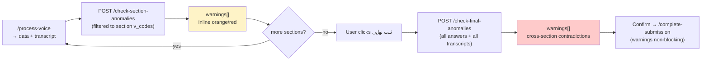

# Anomaly Detection

Two non-blocking quality passes — **per-section** (after each voice upload) and **final cross-section** (at submit) — that flag clinically suspicious answers as Persian warnings.

Source: `app/services/ai_engine.py:184`, `app/routers/questionnaire.py:48`.

---

## When it runs



- **Per-section** — triggered automatically after each successful `/process-voice` (`static/app.js:987`). Non-blocking: warnings highlight fields but don't prevent continuing.
- **Final** — triggered when user clicks the progress panel's **ثبت نهایی** button. First `check-final-anomalies` runs (`static/app.js` submit flow), warnings shown in a confirmation, then `complete-submission` proceeds.

---

## API

### `POST /check-section-anomalies` — `questionnaire.py:48`

Request:

```json
{
  "section_key": "A",
  "answers": {"A1":"35","A4":"1","A9":"N/A"},
  "confidence_reasons": {"A1":"صدای ضعیف", "A4":""},
  "submission_id": "12"
}
```

Behavior (`questionnaire.py:48`):

- Looks up `Section` + its `Question`s, builds `questions_meta` (v_code, question_text_fa, response_type, unit, coding_options).
- Filters `answers` to only the section's `v_codes` (other sections ignored).
- Fetches **one transcript** for the submission (first `Response.transcript` found) — passed to the checker.
- Calls `PromptGenerator.check_anomalies(filtered_answers, questions_meta, confidence_reasons, transcript)`.

Returns:

```json
{"warnings":[{"v_code":"A1","message":"سن ۲۰۰ سال غیرممکن است","severity":"critical"}]}
```

Empty `[]` if consistent. `{error:…}` if misconfigured.

### `POST /check-final-anomalies` — `questionnaire.py:120`

Request:

```json
{
  "submission_id":"12",
  "answers":{"A1":"35","A4":"1","B3":"2"},
  "confidence_reasons":{"B3":"نامشخص"}
}
```

Behavior (`questionnaire.py:132`):

- Validates `submission_id`, loads `Submission`, all `Question`s + `Section`s.
- Builds `vcode_to_question` / `vcode_to_section` maps.
- Groups current `answers` by `section_key` into `all_questions_meta`.
- Collects **latest transcript per section** (one per `Response.v_code` → section) into `transcripts`.
- Calls `PromptGenerator.check_final_anomalies(answers, all_questions_meta, transcripts, confidence_reasons)`.

Same `{warnings:[…]}` response.

---

## Prompt construction

### Per-section — `check_anomalies()` (`ai_engine.py:226`)

```
You are a medical quality control assistant. Review the following patient answers
for clinical inconsistencies, medically suspicious values, contradictions...

IMPORTANT: Be tolerant of small inconsistencies. Only flag clearly medically
significant or unsafe issues. Do not nitpick minor details.
A value of "N/A" means not applicable — never flag it.

Patient answers:
Q: سن شما چند سال است؟ (code A1, type Numeric, unit سال) → ANSWER: 35 options: …
Q: جنسیت (code A4, type Categorical) → ANSWER: 1 options: 1=زن, 2=مرد

The extraction AI flagged the following fields as uncertain; pay extra attention:
- A1: صدای ضعیف

Verbatim transcript of the recording (authoritative record):
…

Return JSON array of warnings: {v_code, message (Persian), severity (warning|critical)}.
If consistent, return [].
Output ONLY valid JSON array.
```

- `_build_field_line()` (`ai_engine.py:213`) includes decoded `options: k=v` so the model reasons about clinical meaning, not opaque codes.
- `confidence_reasons` forwarded as hints (`ai_engine.py:250`).
- Verbatim `transcript` included for confirmation / catching mentioned-but-unextracted values.

Schema: `_format_warning_schema()` (`ai_engine.py:184`) — array of `{v_code, message, severity: warning|critical}`.

### Cross-section — `check_final_anomalies()` (`ai_engine.py:308`)

Same structure but:

- Groups answers by section: `[Section: A] … [Section: B] …`
- All `transcripts` included per section.
- Explicitly described as *"COMPLETE set of answers across ALL form sections. Look for contradictions that span sections (e.g. section B says 'never smoked' while section C meds include COPD drug)."*

Both use the same resilient call wrapper: `_run_with_failover(_call, ANOMALY_MODEL)` where `ANOMALY_MODEL = "gemini-3-flash-preview"`.

---

## Warning contract

```json
{
  "v_code": "A4",
  "message": "مرد با سابقه بارداری ناسازگار است",
  "severity": "critical"
}
```

- `v_code` — which field is suspicious. `general` is reserved for section-level notes (currently not produced but guarded in frontend).
- `message` — short Persian explanation.
- `severity` — `warning` (orange) or `critical` (red). Determined by the model.

Parsing is lenient: `json.loads(response.text)` wrapped in try/except returns `[]` on parse failure (`ai_engine.py:303`).

Examples the prompts aim to catch:

- Male + pregnancy / menstruation (`A4` consistency)
- Diabetes "No" but diagnosis age given
- Age 200, weight 5kg vs height 180cm
- Smoking "never" vs COPD medication

---

## Frontend — `static/app.js:1080`

| Function | Role |
|---|---|
| `applyFieldWarnings()` | Clears `.field-warning`/`.field-critical`, then per `fieldWarnings[v_code]` applies orange/red to input or parent `<label>` (radio/checkbox). Skips `general`. |
| `updateSectionBadges()` | Counts distinct warned `v_code`s per `section[id^="sect-"]`, shows badge number via `#badge-{key}.active`. |
| `updateWarningPanel()` | Sums all warnings, shows `#warning-toggle-btn` + populates `#warning-list` with `v_code: message` items. |
| `toggleWarningPanel()` | Toggles `#warning-list.active` (floating summary, left side). |

Manual edit of a field **clears its warning** — edit handler removes the field from `fieldWarnings`. The badge + panel update automatically.

Visuals (`static/index.html:190`):

- `.field-warning` → orange border (`#f97316`)
- `.field-critical` → red border (`#ef4444`)
- `.section-warning-badge.active` → orange pill with count
- `#warning-summary-panel` — fixed top-left, collapsible list
- `#warning-toggle-btn` — `N هشدار` pill, hidden when 0

---

## Non-blocking by design

Warnings **never block** submission:

- Per-section: user can continue to next section regardless.
- Final: confirmation dialog shows warnings but user can proceed to `complete-submission` (`questionnaire.py:320` simply persists all answers).

This matches clinical reality — the model may hallucinate or be overly strict; the field worker is the final arbiter.

---

## Tuning & gotchas

- **Over-flagging**: adjust the *"Be tolerant … Only flag clearly medically significant"* instruction in `ai_engine.py:232` / `ai_engine.py:316`.
- **Transcript helps accuracy**: without it (e.g. manual-only fields) the checker has less to reason about. `submission_id` must be sent to fetch transcripts.
- **Low-confidence hints**: forward `confidence_reasons` — the checker explicitly pays extra attention to them. Omitting them reduces recall on uncertain fields.
- **Model cost**: two extra Gemini calls per filled form (one per section + one final). For large forms, the final prompt aggregates all sections — can be large.
