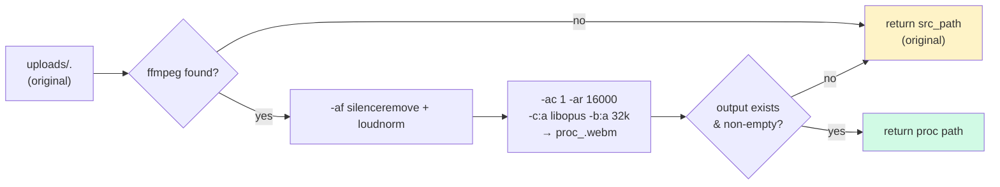
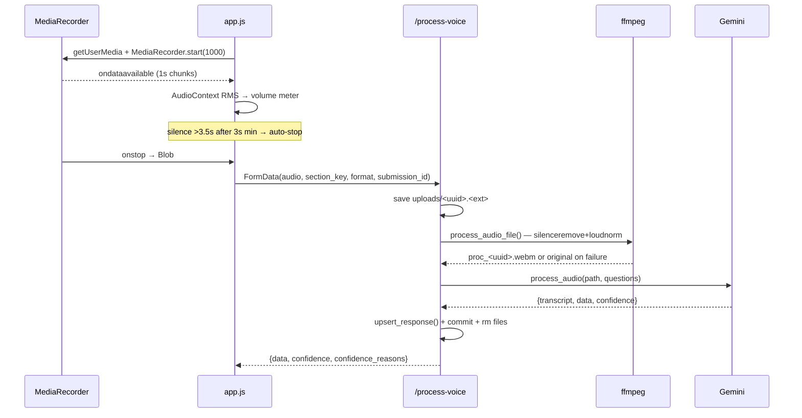

# Voice & Audio Pipeline

From mic click to Gemini-ready audio — browser recording, silence detection, upload, and server ffmpeg preprocessing.

## Browser recording — `static/app.js:758`

### Format negotiation — `getBestAudioMimeType()` (`app.js:48`)

Tries in priority order, uses the first `MediaRecorder.isTypeSupported()`:

| Priority | `mime` | `label` | Bitrate | Codec |
|---|---|---|---|---|
| 1 | `audio/webm` | `webm` | 32 kbps | Opus |
| 2 | `audio/mp4` | `m4a` | 64 kbps | AAC |
| 3 | `audio/ogg` | `ogg` | 64 kbps | Vorbis |
| 4 | `audio/wav` | `wav` | uncompressed | PCM |

```js
const audioFormat = getBestAudioMimeType();
const mediaRecorder = new MediaRecorder(stream, {
  mimeType: audioFormat.mime,
  audioBitsPerSecond: audioFormat.bitrate  // if set
});
mediaRecorder.audioFormat = audioFormat;   // stashed for upload
```

Logged as `✅ Using format: audio/webm (opus @ 32kbps)`.

### Silence detection & volume meter — `toggleRecording()` (`app.js:812`)

```js
const SILENCE_THRESHOLD   = 0.01;   // RMS below this = silence
const SILENCE_DURATION_MS = 3500;   // auto-stop after this much silence
const MIN_RECORDING_MS    = 3000;   // ignore silence before this
```

- `AudioContext` + `AnalyserNode` (fft 256) + `ScriptProcessor` (256 samples) computes RMS per buffer.
- **Volume meter** (`#volume-meter-fill`) — height `min(rms/0.2*100,100)%`, color:
  - `<0.005` → red (`#ef4444`) too quiet
  - `>0.25` → orange (`#f97316`) too loud
  - `>0.15` → yellow, else green.
- Before `MIN_RECORDING_MS` elapses, silence is ignored (prevents cutting off on initial pause).
- After that, continuous silence > `SILENCE_DURATION_MS` auto-calls `toggleRecording(activeRecordingSection)` → `mediaRecorder.stop()`.

Also: floating stop button (`#floating-stop-btn`) + `#volume-meter-container` shown during recording (`showFloatingStopButton`).

### Upload — `sendAudioToServer()` (`app.js:884`)

```js
const formData = new FormData();
formData.append("audio", audioBlob, `voice.${ext}`);
formData.append("section_key", sectionKey);
formData.append("audio_format", savedFormat.label);
formData.append("bitrate", savedFormat.bitrate || "");
if (currentSubmissionId) formData.append("submission_id", currentSubmissionId);
await fetch("/process-voice", { method: "POST", body: formData });
```

- Blob held in `lastAudioBySection[sectionKey]` for retry without re-recording.
- File extension derived from `label` (`m4a` special-cased).
- Logs: `📤 Uploading webm (32kbps): 48.23 KB`.

### Retry UX — `offerAudioRetry()` (`app.js:1029`)

On any `result.error` or fetch failure, if the blob is still held, a modal (`#audio-retry-modal`) offers **تلاش مجدد** (retry) — re-calls `sendAudioToServer(sectionKey, null)` from the held blob. `Esc` closes the modal. No re-recording needed.

---

## Server preprocessing — `app/services/audio_processor.py:38`

### `process_audio_file(src_path)`



Code:

```python
ffmpeg = os.getenv("FFMPEG_PATH") or shutil.which("ffmpeg")
if not ffmpeg:
    return src_path

OUT_EXT, OUT_CODEC, OUT_BITRATE = "webm", "libopus", "32k"
OUT_SR, OUT_CHANNELS = 16000, 1
TRIM_THRESHOLD_DB, MAX_INTERNAL_SILENCE_S = -40, 0.6
LOUDNORM = "I=-16:TP=-1.5:LRA=11"

af = (
  f"silenceremove=start_periods=1:start_threshold={TRIM_THRESHOLD_DB}dB"
  f":start_silence=0:detection=peak,"
  f"silenceremove=stop_periods=-1:stop_threshold={TRIM_THRESHOLD_DB}dB"
  f":stop_duration={MAX_INTERNAL_SILENCE_S}:detection=peak,"
  f"loudnorm={LOUDNORM}"
)
cmd = [ffmpeg, "-y", "-i", src_path, "-af", af,
       "-ac", "1", "-ar", "16000", "-c:a", "libopus", "-b:a", "32k",
       out_path]
subprocess.run(cmd, check=True, stdout=DEVNULL, stderr=DEVNULL, timeout=120)
```

| Step | Filter | Purpose |
|---|---|---|
| Leading silence trim | `silenceremove=start_periods=1:start_threshold=-40dB` | Remove silence at start |
| Trailing + internal collapse | `silenceremove=stop_periods=-1:stop_duration=0.6` | Trim trailing & collapse gaps >0.6s |
| Loudness | `loudnorm=I=-16:TP=-1.5:LRA=11` | EBU R128 normalization — consistent ASR levels |
| Resample | `-ar 16000 -ac 1` | 16 kHz mono — Gemini-optimal |
| Encode | `-c:a libopus -b:a 32k` | Small, high-quality speech codec → `.webm` |

**Graceful fallback** — any failure (`CalledProcessError`, `TimeoutExpired`, `OSError`, empty output) logs a warning and returns the **original file** so the field worker never loses a take (`audio_processor.py:68`). Files are cleaned up only on success (`questionnaire.py:502`).

To switch to WAV: set `OUT_CODEC = None` (uses `pcm_s16le`) and `OUT_EXT = "wav"` — noted in `audio_processor.py:18`.

### `POST /process-voice` — `app/routers/questionnaire.py:396`

Validates:

- `Content-Type` must be in `{audio/webm, audio/mp4, audio/ogg, audio/wav, audio/mpeg}` (`questionnaire.py:413`), else Persian error.
- `section_key` must exist.
- `submission_id` if provided must exist and be numeric.

Saves upload as `uploads/<uuid>.<ext>`, calls `process_audio_file()`, then `PromptGenerator.process_audio(processed_path, questions)` (see [AI Engine](ai-engine.md)). Persists via `upsert_response()` per `v_code` (with `group_index` parsing), commits, deletes both original + processed files on success.

Returns:

```json
{
  "data": {"A1":"35","A4":"1"},
  "confidence": {"A1":0.95,"A4":1},
  "confidence_reasons": {"A1":"","A4":""}
}
```

Errors are returned as `{error: "..."}` with Persian messages where applicable.

---

## End-to-end timeline



---

## Tuning

| Knob | Where | When to change |
|---|---|---|
| `SILENCE_THRESHOLD` / `SILENCE_DURATION_MS` / `MIN_RECORDING_MS` | `static/app.js:11` | Field workers cut off too early/late |
| `OUT_BITRATE` (`32k` → `64k`) | `app/services/audio_processor.py:22` | `FIXES.md:5` — try 64k if ASR quality suffers |
| `TRIM_THRESHOLD_DB` (`-40`) | `audio_processor.py:27` | Too aggressive trimming |
| `LOUDNORM` | `audio_processor.py:31` | Adjust for consistently quiet/loud environments |
| `OUT_SR` | `audio_processor.py:23` | 16 kHz is Gemini-recommended; don't change without testing |

!!! tip "Upload size"
    At 32 kbps Opus, a 30s recording is ~120 KB — small enough for flaky field networks. WAV at 16 kHz mono would be ~940 KB for the same duration.
