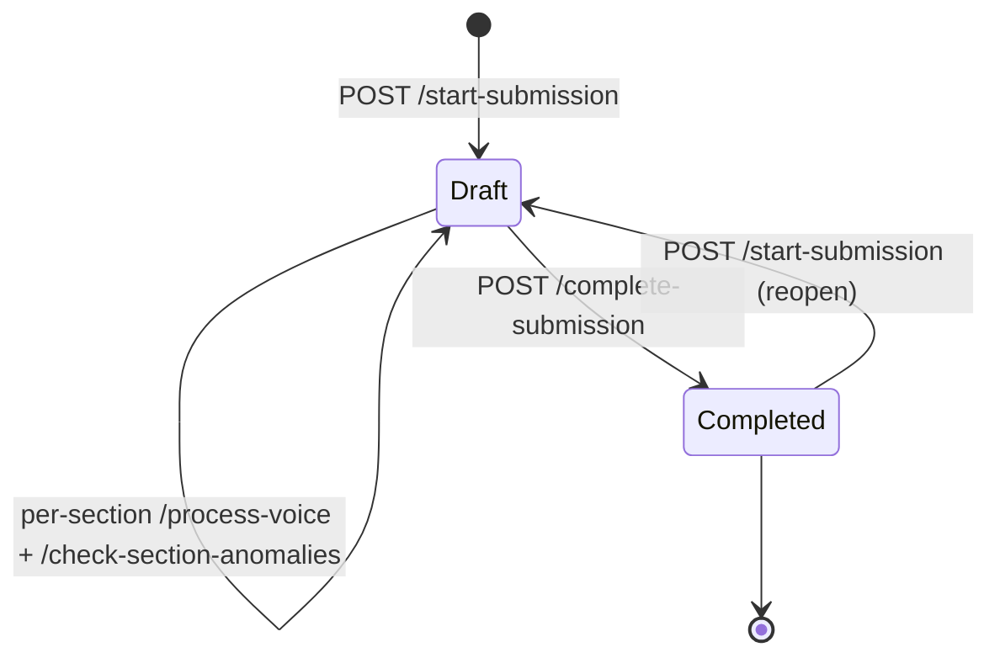
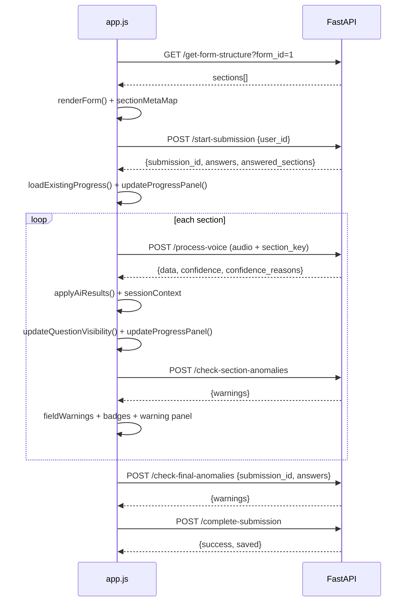

# Questionnaire Flow

How a submission moves from **draft** to **completed**, and how the frontend orchestrates it.

## Lifecycle



### `POST /start-submission` — `app/routers/questionnaire.py:199`

Creates or reuses a `(user_id, form_id)` submission. Two paths:

- **By `user_id`**: existing user looked up directly.
- **By `user: {national_code,…}`**: reuse by `national_code` (unique) or create. `payload.user` fields: `first_name`, `last_name`, `national_code` (required), `phone_number`, `role`.

Form resolution: `payload.form_id` if given, else **first form** ordered by `form_name` (`questionnaire.py:254`). Returns error if no forms exist.

**Progressive resume** (`questionnaire.py:262`): the most recent submission for `(user_id, form_id)` ordered by `created_at` is reused regardless of status. A `completed` one is reopened to `draft` so remaining sections can be filled. Already-saved answers are returned:

```json
{
  "submission_id":"12","user_id":"3","status":"draft",
  "answers":{"A1":"35","A4":"1","D1_0":"متفورمین"},
  "confidence":{"A1":0.9},
  "answered_sections":["A"]
}
```

The frontend seeds `sessionContext`, `sessionConfidence`, calls `applyAiResults()` and `markSectionAnswered()` (`static/app.js:164`).

### Per-section voice loop

For each section, `toggleRecording()` → `sendAudioToServer()` → `applyAiResults()` → `check-section-anomalies` — see [Audio Pipeline](audio-pipeline.md) and [Anomaly Detection](anomaly-detection.md).

### `POST /complete-submission` — `app/routers/questionnaire.py:320`

Persists the final answer set (including manually typed fields) and marks `status=completed`:

- Expects `{ submission_id, answers: {v_code: value}, confidence: {v_code: 0..1} }`.
- Parses grouped keys via `/^(.+?)_(\d+)$/` — base code + `group_index`.
- For each entry, `upsert_response()` is called; `is_voice` is preserved if value unchanged, else set `False` (manual edit).
- Empty / `null` / `""` values are skipped (`questionnaire.py:349`).
- Sets `submission.status = "completed"` and `updated_at = now()`.

Returns `{success, submission_id, saved}`.

---

## Frontend state — `static/app.js:17`

| Variable | Type | Purpose |
|---|---|---|
| `sessionContext` | `{v_code: value}` | Authoritative answer map — voice + manual |
| `sessionConfidence` | `{v_code: 0..1}` | AI confidence per field |
| `sessionConfidenceReasons` | `{v_code: reason}` | Why confidence < 1 |
| `sectionMetaMap` | `{section_key: {depends_on_*}}` | Visibility rules |
| `fieldWarnings` | `{v_code: [{message, severity}]}` | Accumulated anomaly warnings |
| `currentSubmissionId` | string | Set by `/start-submission` |
| `lastAudioBySection` | `{section_key: Blob}` | Held for retry without re-recording |
| `sectionProgressData` | `{section_key: {name_fa, total, answered}}` | Progress panel counts |
| `groupEntryCounts` | `{group_pair: int}` | Number of rows per grouped container |

Flow in `DOMContentLoaded` (`static/app.js:26`):

1. `GET /get-form-structure?form_id=…` → `renderForm()` + `updateQuestionVisibility()`.
2. `autoStartFromSession()` → reads `localStorage.vcr_user` → `POST /start-submission` → `loadExistingProgress()` → `updateProgressPanel()`.

If `vcr_user` missing/invalid → redirect to `/login` after 3s.

---

## Progress & visibility

### Visibility — `updateQuestionVisibility()` (`static/app.js:226`)

Hides/shows `section[id^="sect-"]` based on `sectionMetaMap`. `display: none` + `opacity: 0`.

### Progress panel — `updateProgressPanel()` (`static/app.js:556`)

Counts **once per `v_code`** per visible section:

- Checkbox: any checked → answered.
- Radio: any checked → answered.
- Text: non-empty or `data-na="1"` → answered.
- Grouped: only `*_0` counts (`static/app.js:586`).

Updates:

- Per-section list: `answered / total` + bar (green/amber/gray).
- Overall ring + bar: `Σ answered / Σ total`.
- Submit button: disabled if `totalAnswered === 0`.
- Header `status-badge`: `📊 X از Y` or `✅ همه بخش‌ها تکمیل شد`.

Hidden sections are **excluded** from totals (`static/app.js:610`).

### Section completion badge

`markSectionAnswered(sectionKey)` (`static/app.js:194`) adds `.section-answered` (green tint) + badge `✓ تکمیل شد`. Used for progressive resume.

---

## Special values

### `N/A` — logically not applicable

When the AI determines a question doesn't apply (gateway is "No"), it returns exactly `"N/A"` (`app/services/ai_engine.py:605`). Frontend tags inputs with `data-na="1"`, clears value, sets placeholder `غیرمرتبط`, and counts as answered (`static/app.js:1172`). Anomaly checker never flags `N/A` (`ai_engine.py:236`).

### `null` — not mentioned

`null` means the speaker didn't mention the field. Not rendered; progress counts it as unanswered. `null` with confidence `1` + empty reason is valid (`ai_engine.py:615`).

---

## Submission inspection

- **User dashboard** (`GET /api/dashboard?user_id=…` with `role=1`): lists own submissions with `response_count / total_questions`, `open_forms` (forms not started).
- **Admin dashboard** (`role=2`): same endpoint returns `stats` + `forms`. Detailed view via `GET /api/admin/submission/{id}` and paginated `GET /api/admin/submissions`.
- **Export**: `GET /api/admin/export/submissions?format=json` (CSV placeholder).

---

## Sequence (happy path)


