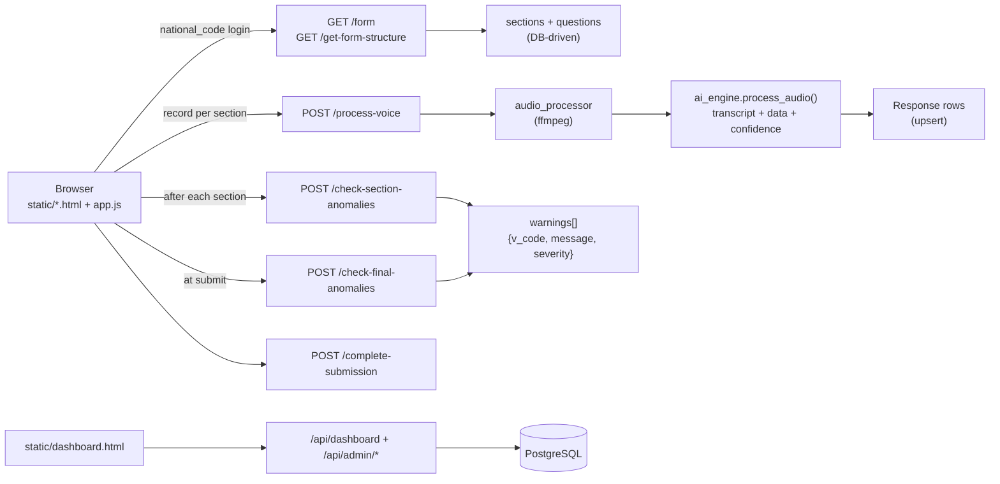

# 🎙️ VCR — Voice Cohort Record

**سیستم استخراج هوشمند داده‌های کوهرت با صدا**

Voice-driven cohort data collection — field workers speak, Gemini extracts, the system validates. Persian-first, RTL-native, fully database-driven forms.

FastAPI + PostgreSQL
Google Gemini
Vanilla JS + Tailwind
ffmpeg audio
Docker ready

## What is VCR?

VCR lets a field worker **dictate a patient's answers into the microphone** instead of typing. The browser records per-section audio, the server preprocesses it with `ffmpeg`, and a single Gemini call returns:

- a **verbatim Persian transcript**
- **structured answers** per question (`v_code → value`)
- **per-field confidence** (`0..1`) + **reasons** when uncertain
- handling of **conditional logic** (`N/A` for inapplicable questions) and **grouped/repeated items** (`V_1`, `V_2`, …)

A second Gemini pass flags **clinical anomalies** — section-local and cross-section — as non-blocking warnings (`warning` / `critical`) in Persian.

The entire form (forms → sections → questions) lives in PostgreSQL. No code change needed to add a new questionnaire.

---

## Key capabilities at a glance

- :material-account-voice: **Voice per section**

    ---

    Each section has its own *ثبت با صدا* button. Live RMS volume meter, auto-stop after ~3.5s silence (3s minimum), manual override always available, re-record safe.

- :material-brain: **Single-request extraction**

    ---

    Transcript + structured data + confidence + reasons in **one** Gemini call. Type-aware prompting per `response_type` (categorical, numeric with unit conversion, date, text, MultiSelect, grouped).

- :material-shield-check: **Clinical anomaly detection**

    ---

    Per-section check + final cross-section pass at submit. Low-confidence hints forwarded, `N/A` never flagged, warnings are non-blocking orange/red inline + floating summary panel.

- :material-database-cog: **DB-driven forms**

    ---

    `Form → Section → Question` with `depends_on` / `skip_if` visibility rules, `coding_options` (JSONB), `manual_prompt` override, `group_pair` for repeated items. Full admin CRUD via `/api/admin/*`.

- :material-waveform: **ffmpeg audio pipeline**

    ---

    Silence trim → internal-silence collapse → EBU R128 loudness normalization → 16 kHz mono Opus/WebM. Graceful fallback to original file if ffmpeg missing/fails.

- :material-key-variant: **Resilient Gemini access**

    ---

    Round-robin key rotation, retry with backoff on 429/500/503/timeouts, model failover chain (`gemini-3-flash-preview` → fallbacks). Proxy-aware (`GENAI_PROXY`).

---

## Architecture in 30 seconds

**Request flow:** `signup/login` → `GET /form` → `GET /get-form-structure` → loop: `record → /process-voice → /check-section-anomalies` → `POST /check-final-anomalies` → `POST /complete-submission`. Dashboard reads from `/api/dashboard` + `/api/admin/*`.

---

## Where to go next

| You want to… | Go to… |
|---|---|
| Run the project locally | [Installation](getting-started/installation.md) |
| Configure env / DB / keys | [Configuration](getting-started/configuration.md) |
| See the 5-minute happy path | [Quick Start](getting-started/quickstart.md) |
| Understand models & relationships | [Data Model](architecture/data-model.md) |
| See the full HTTP API | [API Overview](api/overview.md) |
| Deploy with Docker / HF Spaces | [Deployment](operations/deployment.md) |
| Harden for production | [Security](operations/security.md) |

---

## Project status & caveats

!!! warning "Read the manual before exposing publicly"
    - Login is **national-code-only** (no password) — identification, not authentication.
    - `/api/admin/*` has **no authorization check** today. The dashboard only hides admin UI client-side by role. Do not expose publicly without adding auth.
    - Audio uploads land in `uploads/` then are deleted on success — treat the DB as containing PII.

!!! note "README vs. reality — verified against code"
    This docs site is built from **source**, not from README alone. Notable corrections:

    - `GEMINI_API_KEYS` / `GEMINI_API_KEY` / `GOOGLE_API_KEY` all accepted (comma-separated, order preserved, deduped) — see [Configuration](getting-started/configuration.md).
    - `GEMINI_FALLBACK_MODELS` default in code is `gemini-3.1-flash-lite,gemini-3.5-flash` but both `AUDIO_MODEL` and `ANOMALY_MODEL` default to `gemini-3-flash-preview` (`app/core/config.py:24`).
    - CDN proxy routes (`/cdn/tailwindcss`, `/cdn/vazirmatn`) exist but `static/*.html` currently load CDNs directly (`cdn.jsdelivr.net` / `tailwindcss/browser`); proxy is opt-in (uncomment in HTML).
    - Forms/sections/questions `sort_order` drives display order; `GET /get-form-structure` optionally filters by `?form_id=`.

---

## Tech stack

| Layer | Technology |
|---|---|
| Backend | FastAPI, Uvicorn |
| Database | PostgreSQL, SQLAlchemy ORM (no migrations — `create_all` on startup) |
| AI | `google-genai` — Gemini with key rotation + model failover |
| Frontend | Vanilla JS, Tailwind CSS (via CDN / proxied), Vazirmatn font, RTL |
| Audio | Browser `MediaRecorder` + server `ffmpeg` |
| Config | `python-dotenv`, env-driven (see [Configuration](getting-started/configuration.md)) |
